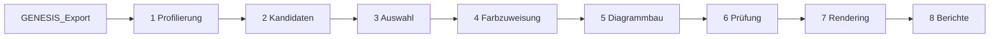

# Methodendokumentation: Erzeugung synthetischer Visualisierungen aus GENESIS-Online

Dieses Dokument beschreibt das Verfahren, mit dem `genesis_diagramme.py` aus den Tabellen von GENESIS-Online
reproduzierbar Datenvisualisierungen erzeugt. Es erläutert die einzelnen Stufen, die zugrunde liegenden Regeln und
deren Begründung. Alle Parameter stehen in `config.yaml`; die Angaben in diesem Dokument beziehen sich auf die dort
hinterlegten Voreinstellungen.

## Inhalt

1. [Ziel und Anforderungen](#1-ziel-und-anforderungen)
2. [Datengrundlage](#2-datengrundlage)
3. [Ablagestruktur](#3-ablagestruktur)
4. [Überblick über die Pipeline](#4-überblick-über-die-pipeline)
5. [Stufe 1: Profilierung](#5-stufe-1-profilierung)
6. [Stufe 2: Kandidatengenerierung](#6-stufe-2-kandidatengenerierung)
7. [Stufe 3: Stratifizierte Auswahl](#7-stufe-3-stratifizierte-auswahl)
8. [Stufe 4: Farbzuweisung](#8-stufe-4-farbzuweisung)
9. [Stufe 5: Diagrammbau](#9-stufe-5-diagrammbau)
10. [Stufe 6: Automatische Prüfung](#10-stufe-6-automatische-prüfung)
11. [Stufe 7: Rendering](#11-stufe-7-rendering)
12. [Stufe 8: Berichte](#12-stufe-8-berichte)
13. [Reproduzierbarkeit](#13-reproduzierbarkeit)
14. [Grenzen des Verfahrens](#14-grenzen-des-verfahrens)
15. [Parameter und Aufrufoptionen](#15-parameter-und-aufrufoptionen)
16. [Literatur](#16-literatur)

---

## 1. Ziel und Anforderungen

Ziel ist ein großer, vielfältiger und vollständig nachvollziehbarer Bestand an Datenvisualisierungen, wie sie in der
journalistischen Berichterstattung vorkommen. Die Grafiken sind fachlich und gestalterisch korrekt; absichtlich
fehlerhafte Varianten sind nicht Teil des Verfahrens.

| Nr. | Anforderung | Umsetzung |
|---|---|---|
| A1 | **Vielfalt der Diagrammtypen** | 36 Diagrammtypen ([6](#6-stufe-2-kandidatengenerierung)) |
| A2 | **Ausgewogenheit** über die neun Themenbereiche der amtlichen Statistik | Quotenzuteilung über Themenbereich und Diagrammtyp ([7](#7-stufe-3-stratifizierte-auswahl)) |
| A3 | **Entkopplung der Gestaltung:** Farbe darf weder Diagrammtyp noch Themenbereich vorhersagen | balancierte Farbzuweisung mit Unabhängigkeitstest ([8](#8-stufe-4-farbzuweisung)) |
| A4 | **Faktentreue:** jede Aussage einer Grafik ist aus den Daten belegbar | datengebundene Überschriften mit Faktenprotokoll ([9](#9-stufe-5-diagrammbau)) |
| A5 | **Redaktionelle Gestaltung** | einheitlicher Aufbau, Plausibilitäts- und Beschriftungsregeln ([9](#9-stufe-5-diagrammbau), [10](#10-stufe-6-automatische-prüfung)) |
| A6 | **Reproduzierbarkeit:** gleiche Eingaben ergeben gleiche Ergebnisse | fester Startwert, fixierte Versionen, Prüfsummen ([13](#13-reproduzierbarkeit)) |
| A7 | **Nachvollziehbarkeit:** jede Entscheidung ist dokumentiert | Zwischenergebnisse jeder Stufe, Manifest ([12](#12-stufe-8-berichte)) |

---

## 2. Datengrundlage

**Quelle:** GENESIS-Online, die Datenbank des Statistischen Bundesamtes (Destatis). Der Abruf erfolgt mit
`export/genesis_export.py` über die REST-Schnittstelle (Statistisches Bundesamt, 2026): Daten über die Methode
`data/tablefile` im Format Flatfile-CSV (`ffcsv`), Metadaten über `metadata/table` und `metadata/statistic`.
Die Daten stehen unter der Datenlizenz Deutschland – Namensnennung – Version 2.0.

### 2.1 Umfang des Exports (Stand 28.09.2026)

| Themenbereich | Statistiken | Tabellen | enthalten | nicht enthalten¹ |
|---|---:|---:|---:|---:|
| 1 Gebiet, Bevölkerung, Arbeitsmarkt, Wahlen | 27 | 437 | 414 | 23 |
| 2 Bildung, Sozialleistungen, Gesundheit, Recht | 83 | 718 | 697 | 21 |
| 3 Wohnen, Umwelt | 28 | 210 | 202 | 8 |
| 4 Wirtschaftsbereiche | 105 | 811 | 757 | 54 |
| 5 Außenhandel, Unternehmen, Handwerk | 12 | 235 | 221 | 14 |
| 6 Preise, Verdienste, Einkommen und Verbrauch | 31 | 304 | 299 | 5 |
| 7 Öffentliche Finanzen, Steuern, Personal | 27 | 158 | 149 | 9 |
| 8 Gesamtrechnungen | 14 | 150 | 150 | 0 |
| 9 Querschnittsthemen | 4 | 16 | 16 | 0 |
| **Summe** | **331** | **3.039** | **2.907** | **132** |

¹ Tabellen, die das Ergebnislimit der Schnittstelle überschreiten, Tabellen mit serverseitigem Fehler sowie die beiden
Tabellen 12421-0002 und 12421-0004, die mit über 100 MB nicht im Repository enthalten sind. Tabellen über 50 MB
schließt das Verfahren ohnehin aus (Kriterium E2, [Abschnitt 5.2](#52-ausschlusskriterien)).

### 2.2 Eigenschaften der Daten

- Mediane Dateigröße 0,09 MB, mediane Zeilenzahl 345.
- Zeitangaben als Jahre, Stichtage oder ISO-8601-Perioden (z. B. `2026-05P1M`, `2024-P1Y`).
- Häufigste Einheiten: Anzahl, Tsd. EUR, 1000, Prozent, EUR, Index (2021 = 100), t, ha, Mill. EUR.
- Rund 10 % der Tabellen bestehen überwiegend aus Sonderzeichen für fehlende Werte (`.`, `-`, `/`, `x`).
- **Keine Qualitätskennzeichen:** Das Flatfile-CSV der Schnittstelle enthält keine Spalte `value_q`. Die Kennzeichen
  „()“ (eingeschränkte Aussagekraft), „p“ (vorläufig) und „r“ (revidiert) stehen daher nicht zur Verfügung
  ([Abschnitt 9.4](#94-stichprobenerhebungen)).
- **Abgeleitete Werte in derselben Spalte:** Abgeleitete Werte (z. B. „Veränderung in %“) stehen unter demselben
  Merkmalscode wie die eigentlichen Werte und unterscheiden sich nur in Bezeichnung und Einheit. Eine Messgröße wird
  deshalb als Tripel aus Code, Bezeichnung und Einheit identifiziert.
- **Mehrfach vorkommende Bezeichnungen:** Dieselbe Bezeichnung kann auf mehreren Ebenen einer Systematik vorkommen.
  Identische Zeilen werden zusammengefasst; widersprüchliche Werte führen zum Ausschluss des Ausschnitts.
- **Summenzeilen:** Als Summenzeile gilt ein leerer Ausprägungscode oder die Bezeichnung „Insgesamt“.

---

## 3. Ablagestruktur

```
├── README.md
├── export\                          Export-Werkzeug
│   ├── genesis_export.py            Abruf aller Tabellen über die GENESIS-Schnittstelle
│   └── genesis_zugang.example.ini   Vorlage für die Zugangsdaten
├── GENESIS_Export\                  Rohdaten, werden nur gelesen
│   ├── _katalog\                    Verzeichnis aller Statistiken, Tabellen und Merkmale
│   └── <1..9>_<Themenbereich>\<Statistik>\<Tabelle>\
│       ├── <Tabelle>_flatfile.csv   Daten (unverändert)
│       ├── <Tabelle>_metadaten.json Metadaten der Tabelle
│       └── <Tabelle>_herkunft.json  Quelle, Abrufparameter, Zeitpunkt, SHA-256
├── diagramme\                       Verfahren
│   ├── genesis_diagramme.py         Pipeline (alle Stufen)
│   ├── diagramme.py                 Bauvorschriften der 36 Diagrammtypen
│   ├── gestaltung.py                Farbthemen, Paletten, Farbprüfung
│   ├── geometrie.py                 Kartengeometrie
│   ├── uebersicht.py                Übersichtsseite
│   ├── config.yaml                  alle Parameter
│   ├── requirements.txt             fixierte Paketversionen
│   ├── geo\                         Verwaltungsgrenzen (BKG, VG5000)
│   └── METHODE.md                   dieses Dokument
└── GENESIS_Diagramme\               Ergebnis eines Laufs
    ├── <1..9>_<Themenbereich>\<Statistik>\<Tabelle>\
    │   ├── <Tabelle>_flatfile.csv            Kopie der Quelldaten
    │   ├── <Tabelle>_metadaten.json          Kopie der Metadaten
    │   ├── <Tabelle>_<nn>_<typ>.png          Grafik (1520 px breit)
    │   ├── <Tabelle>_<nn>_<typ>.vl.json      Vega-Lite-Spezifikation mit eingebetteten Daten
    │   └── <Tabelle>_<nn>_<typ>_info.json    Entscheidungen und Belege zu dieser Grafik
    ├── _bericht\                    Zwischenergebnisse und Auswertungen
    ├── _zwischenspeicher\           Profilierung für schnellere Folgeläufe
    ├── config.yaml                  verwendete Konfiguration (Kopie)
    ├── manifest.json                alle Grafiken mit Prüfsummen, Versionen und Startwert
    └── uebersicht.html              Übersicht mit Filter und Suche
```

Rohdaten und abgeleitete Daten sind getrennt: Die Rohdaten bleiben unverändert, und das Verfahren lässt sich jederzeit
vollständig neu ausführen. Jeder Tabellenordner im Ergebnis enthält die Quelldaten zusammen mit den daraus erzeugten
Grafiken, sodass die Herkunft jeder Grafik unmittelbar erkennbar ist. Der Tabellencode im Dateinamen erlaubt es, bei
einer späteren Aufteilung in Trainings-, Validierungs- und Testdaten alle Grafiken einer Tabelle derselben Teilmenge
zuzuordnen und so Datenleckage zu vermeiden. Ordnernamen enthalten den Tabellencode statt des vollständigen Titels,
weil Windows Pfade standardmäßig auf 260 Zeichen begrenzt; der vollständige Titel steht in `*_info.json` und im Manifest.

---

## 4. Überblick über die Pipeline

Das Verfahren wird mit einem Aufruf ausgeführt (`diagramme_auto_erstellen.bat` bzw. `python genesis_diagramme.py`).
Es besteht aus acht Stufen; jede Stufe speichert ihr Ergebnis, sodass jede Entscheidung einzeln belegbar ist.



| Stufe | Aufgabe | Ergebnis |
|---|---|---|
| 1 Profilierung | Struktur jeder Tabelle bestimmen, ungeeignete Tabellen ausschließen | `profil_tabellen.csv`, `ausschluesse.csv` |
| 2 Kandidaten | alle zulässigen Diagramme je Tabelle mit Qualitätswert bilden | `kandidaten.csv`, `kapazitaet.csv` |
| 3 Auswahl | N Diagramme ausgewogen auswählen | `quoten.csv`, `auswahl.csv` |
| 4 Farbzuweisung | Farbthema und Palette balanciert zuweisen | `farbpruefung.csv`, Spalten in `auswahl.csv` |
| 5 Diagrammbau | Vega-Lite-Spezifikation mit Überschrift, Sachzeile und Quellzeile | `*.vl.json`, `*_info.json` |
| 6 Prüfung | automatische Prüfungen je Grafik | `qualitaet.csv` |
| 7 Rendering | PNG mit vl-convert | `*.png` |
| 8 Berichte | Manifest, Übersicht, Unabhängigkeitstest, Zusammenfassung | `manifest.json`, `uebersicht.html`, `unabhaengigkeit_farbe.csv`, `bericht.md` |

Alle Berichtsdateien liegen in `GENESIS_Diagramme/_bericht/`.

---

## 5. Stufe 1: Profilierung

Jede Tabelle wird zusammen mit ihren Metadaten gelesen (Trennzeichen `;`, UTF-8). Zahlen im deutschen Format werden
umgewandelt (`1.234,5` → 1234,5). Sonderzeichen (`-`, `.`, `...`, `/`, `x`) gelten als fehlende Werte und werden nie
als 0 behandelt oder dargestellt.

### 5.1 Klassifikation der Merkmale

Jedes Merkmal wird regelbasiert genau einer Rolle zugeordnet. Die Regeln werden in fester Reihenfolge angewendet; die
erste zutreffende Regel entscheidet.

| Rolle | Erkennungsregel |
|---|---|
| Zeit (Hauptachse) | Spalte `time`; Jahr, Stichtag, Jahr/Jahr oder ISO-Periode |
| Zeit (unterjährig) | Merkmalscode `MONAT`, `QUARTG`, `QUARM*` |
| Region Deutschland | Code `DINSG`/`DG` bzw. einziges Gebiet „Deutschland“ |
| Bereinigungsverfahren | Ausprägung „Originalwerte“ neben bereinigten Reihen; das Merkmal wird auf „Originalwerte“ festgelegt, da Verfahrensvarianten keine inhaltlichen Kategorien sind |
| Region Bundesländer | Code `DLAND`/`DLANDU` oder mindestens 14 der Schlüssel 01–16 bei höchstens 20 Ausprägungen |
| Region Regierungsbezirke | Code beginnt mit `REGBEZ` |
| Region Kreise | Code `KREISE` oder mindestens 80 % fünfstellige Schlüssel |
| Region Staaten | Merkmal mit Staaten bzw. Ländergruppen |
| Geschlecht | Code `GES` |
| Alter | Code beginnt mit `ALT` |
| Geordnete Klassen | mindestens zwei Ausprägungen mit „unter“, „bis unter“, „und mehr“, „und älter“ |
| Nominale Kategorie | alle übrigen Merkmale mit mindestens zwei Ausprägungen |

Zusätzlich werden je Tabelle erfasst: Anzahl der Zeitpunkte, Messgrößen und Einheiten, Vorhandensein einer
Summenzeile, Anteil fehlender Werte und die Art der Messgröße (additive Bestandsgröße oder Verhältnisgröße wie Quote,
Anteil, Index oder Durchschnitt).

### 5.2 Ausschlusskriterien

| Nr. | Kriterium | Schwellenwert (`config.yaml`) | Begründung |
|---|---|---|---|
| E1 | Datei fehlt oder ist leer | – | keine Daten |
| E2 | Dateigröße | > 50 MB (`max_mb`) | Rechenaufwand ohne Mehrwert für den Bestand |
| E3 | zu wenige Werte | < 6 Datenzeilen (`min_zeilen`) | keine sinnvolle Grafik möglich |
| E4 | zu viele fehlende Werte | > 80 % (`max_anteil_fehlend`) | Grafik wäre überwiegend leer |
| E5 | inhaltliche Dublette | gleiche Statistik, Merkmale und Messgrößen wie eine neuere Tabelle (`dubletten_entfernen`) | Doppelungen vermeiden |

Jeder Ausschluss wird mit Kriterium in `ausschluesse.csv` festgehalten.

---

## 6. Stufe 2: Kandidatengenerierung

### 6.1 Diagrammtypen

Die Diagrammform folgt der Aufgabe, die eine Grafik für die Daten erfüllen soll. Grundlage sind die Ausdrucks- und
Effektivitätskriterien von Mackinlay (1986), die Rangfolge der Wahrnehmungsgenauigkeit nach Cleveland und McGill
(1984) sowie die aufgabenbezogene Einteilung des Visual Vocabulary der Financial Times (o. J.). Für jede Tabelle werden
alle Typen gebildet, deren Datenanforderungen erfüllt sind. Der Idealbereich gibt die Zahl der Kategorien bzw.
Einheiten an, für die ein Typ am besten lesbar ist.

| Nr. | Typ | Aufgabe | Datenanforderung | Idealbereich |
|---:|---|---|---|---|
| 1 | Horizontale Balken, sortiert | Rangfolge | Kategorien oder Bundesländer | 5–20 |
| 2 | Lollipop | Rangfolge | Kategorien | 10–25 |
| 3 | Punktdiagramm | Rangfolge | Kategorien mit geringer Spannweite | 5–20 |
| 4 | Slope-Chart | Rangfolge im Zeitvergleich | zwei Zeitpunkte | 5–12 |
| 5 | Divergierende Balken | Abweichung | positive und negative Werte | 4–16 |
| 6 | Abweichung vom Bundeswert | Abweichung | Bundesländer und Bundeswert, Verhältnisgröße | 16 |
| 7 | Dumbbell | Vergleich zweier Gruppen | Geschlecht oder zwei Zeitpunkte | 4–12 |
| 8 | Gruppierte Balken | Vergleich | zwei bis vier Gruppen je Kategorie | 3–8 |
| 9 | Bevölkerungspyramide | Verteilung | Alter × Geschlecht | 15–100 |
| 10 | 100-%-Stapelbalken | Teil-Ganzes | Summenzeile, mehrere Teile je Gruppe | 3–12 |
| 11 | Häufigkeitsskala | Teil-Ganzes | Häufigkeitsausprägungen („jeden“, „regelmäßig“ …) | 3–12 |
| 12 | Donut | Teil-Ganzes | Summenzeile, wenige Teile | 2–4 |
| 13 | Tortendiagramm | Teil-Ganzes | zwei bis drei deutlich verschiedene Teile | 2–3 |
| 14 | Treemap | Teil-Ganzes | Summenzeile, viele Teile | 8–30 |
| 15 | Waffeldiagramm | Teil-Ganzes | ein prägnanter Anteil | 2–3 |
| 16 | Säulen geordneter Klassen | Verteilung | geordnete Klassen (Alter, Einkommen, Entfernung) | 4–12 |
| 17 | Streifendiagramm | Verteilung | viele gleichartige Einheiten (z. B. Kreise) | 40–500 |
| 18 | Histogramm | Verteilung | viele gleichartige Einheiten | 40–500 |
| 19 | Boxplot | Verteilung im Gruppenvergleich | viele Einheiten je Gruppe | 30–500 |
| 20 | Liniendiagramm | Zeitverlauf | mehrere Zeitpunkte, wenige Reihen | 8–60 |
| 21 | Linien mit Hervorhebung | Zeitverlauf | viele Reihen, eine bis zwei hervorgehoben | 6–16 |
| 22 | Small Multiples | Zeitverlauf | mehrere Reihen (z. B. Bundesländer) | 4–16 |
| 23 | Gestapelte Fläche | Zeitverlauf der Zusammensetzung | Summenzeile, mehrere Teile | 8–60 |
| 24 | Säulen im Zeitverlauf | Zeitverlauf | wenige Zeitpunkte | 4–12 |
| 25 | Veränderungsbalken | Veränderung | zwei Zeitpunkte | 4–16 |
| 26 | Heatmap Jahr × Monat | Saisonalität | unterjährige Zeit, mehrere Jahre | 3–15 |
| 27 | Streudiagramm | Zusammenhang | zwei Messgrößen über Gebietseinheiten | 10–400 |
| 28 | Blasendiagramm | Zusammenhang | drei Messgrößen über Gebietseinheiten | 10–60 |
| 29 | Heatmap zweier Kategorien | Kreuztabelle | zwei Merkmale | 4–16 |
| 30 | Choroplethenkarte Bundesländer | räumliches Muster | Bundesländer, Verhältnisgröße | 16 |
| 31 | Choroplethenkarte Kreise | räumliches Muster | Kreise, Verhältnisgröße | 300–420 |
| 32 | Divergierende Karte | räumliche Abweichung | Bundesländer und Bundeswert | 16 |
| 33 | Symbolkarte | räumliche Größen | Bundesländer oder Kreise, absolute Werte | 16–420 |
| 34 | Choroplethenkarte Regierungsbezirke | räumliches Muster | Regierungsbezirke | 20–45 |
| 35 | Vertikale Säulen | Größenvergleich | wenige Kategorien | 2–7 |
| 36 | Wasserfalldiagramm | Zusammensetzung einer Veränderung | echte Bilanz (Zugang − Abgang = Saldo) | 3–10 |

**Bewusst ausgeschlossen** sind dreidimensionale Diagramme, zwei y-Achsen, Regenbogenskalen und Choroplethenkarten
absoluter Werte, deren Wahrnehmung durch die Flächengröße der Gebiete verzerrt wird (Slocum et al., 2009).

### 6.2 Wahl des Ausschnitts

Hat eine Tabelle mehr Merkmale, als ein Diagrammtyp darstellen kann, werden die übrigen Merkmale auf „Insgesamt“
festgelegt; fehlt eine Summenzeile, wird die Ausprägung mit dem größten Wert gewählt. Querschnittsdiagramme zeigen bei
mehreren Zeitpunkten den letzten Zeitpunkt. Anteile beziehen sich stets auf die Summenzeile des jeweiligen Merkmals.

### 6.3 Qualitätswert eines Kandidaten

Jeder Kandidat erhält einen Qualitätswert q ∈ [0, 1] als gewichtete Summe von vier Teilwerten:

$$q = 0{,}35 \cdot v + 0{,}25 \cdot k + 0{,}20 \cdot l + 0{,}20 \cdot a$$

| Teilwert | Bedeutung | Berechnung |
|---|---|---|
| v | Vollständigkeit | Anteil gültiger Werte im dargestellten Ausschnitt |
| k | Kategorienzahl | 1 im Idealbereich des Typs, außerhalb linear abnehmend |
| l | Lesbarkeit | 1 bei Beschriftungen bis 30 Zeichen, abnehmend bis 60 Zeichen |
| a | Aussagekraft | Variationskoeffizient der Werte, begrenzt auf [0, 1] |

Kandidaten mit q < 0,4 werden verworfen (`min_qualitaet`). Je Tabelle werden höchstens drei Messgrößen geprüft
(`max_wertmerkmale_je_tabelle`). Gewichte und Schwellenwerte sind begründete Setzungen.

---

## 7. Stufe 3: Stratifizierte Auswahl

### 7.1 Ziel

Aus den Kandidaten werden N Diagramme (`anzahl_diagramme`) so ausgewählt, dass sie möglichst gleichmäßig über die neun
Themenbereiche und die 36 Diagrammtypen verteilt sind, ohne die in den Daten vorhandenen Möglichkeiten zu überschreiten.

### 7.2 Zweidimensionale Quotenzuteilung

Sei C(a, t) die Kapazität, also die Zahl zulässiger Kandidaten im Themenbereich a und Diagrammtyp t. Gesucht ist eine
Zuteilung n(a, t) ≤ C(a, t), deren Zeilensummen möglichst nahe an N/9 und deren Spaltensummen möglichst nahe an N/36
liegen.

1. **Randsummen mit Kapazitätsgrenzen (Wasserfüllverfahren):** Übersteigt die Zielgröße eines Bereichs oder Typs dessen
   Kapazität, erhält er seine volle Kapazität; der Überschuss wird gleichmäßig auf die übrigen Bereiche bzw. Typen
   verteilt, bis alle Randsummen zulässig sind.
2. **Iterative proportionale Anpassung** (Deming & Stephan, 1940): Ausgehend von n⁽⁰⁾(a, t) = C(a, t) werden
   abwechselnd die Zeilen und die Spalten auf ihre Zielsummen skaliert und jeweils auf C(a, t) begrenzt, bis sich die
   Randsummen um weniger als `ipf_toleranz` ändern oder `ipf_max_iter` Iterationen erreicht sind.
3. **Ganzzahlige Rundung** nach dem Verfahren der größten Reste (Hamilton-Verfahren; Balinski & Young, 2001), sodass
   die Summe exakt N ergibt.

Seltene Typen und kleine Bereiche erhalten dadurch alle ihre möglichen Diagramme; die übrigen Zellen gleichen aus.
Die vollständige Kapazitätsmatrix steht in `kapazitaet.csv`, Soll- und Ist-Zuteilung in `quoten.csv`.

### 7.3 Auswahl innerhalb einer Zelle

1. Sortierung nach Qualitätswert q (absteigend); Gleichstände werden deterministisch über einen Hashwert aus Startwert
   und Kandidaten-ID entschieden.
2. **Reihum über Statistiken:** Abwechselnd wird aus jeder Statistik der jeweils beste verbleibende Kandidat gewählt,
   damit keine Statistik einen Bereich dominiert.
3. **Nebenbedingungen:** höchstens 10 % der Diagramme eines Bereichs aus derselben Statistik
   (`max_anteil_statistik`) und höchstens acht Diagramme je Tabelle (`max_je_tabelle`), jeweils unterschiedlichen Typs.

Ist eine Zelle wegen der Nebenbedingungen nicht füllbar, wird die Differenz protokolliert und auf andere Zellen
desselben Bereichs verteilt.

### 7.4 Ersatz nicht baubarer Diagramme

Einige Plausibilitätsregeln ([Abschnitt 9.6](#96-plausibilitätsregeln)) lassen sich erst beim Bau prüfen, weil sie den
konkreten Ausschnitt benötigen. Scheitert ein Diagramm, wird der Platz in dieser Reihenfolge neu besetzt:

1. nächstbester Kandidat derselben Zelle nach Qualitätswert (bis zu 25 Versuche);
2. ist die Zelle erschöpft, ein Kandidat desselben Bereichs aus dem bis dahin seltensten Diagrammtyp.

Farbthema und Palette des Platzes werden übernommen, sodass die Farbbalance erhalten bleibt. Die Bereichsquoten haben
damit Vorrang vor den Typquoten. Jeder verworfene Bauversuch steht mit Grund in `nicht_baubar.csv`.

---

## 8. Stufe 4: Farbzuweisung

### 8.1 Begründung

Ein Modell, das überwiegend Grafiken in einem einzigen Farbschema sieht, kann die Farbgebung als Scheinmerkmal für
andere Eigenschaften erlernen (Shortcut Learning; Geirhos et al., 2020). Farbe wird deshalb als kontrollierte
Gestaltungsvariable behandelt: Sie wird systematisch variiert und so zugewiesen, dass sie statistisch unabhängig von
Themenbereich und Diagrammtyp ist.

### 8.2 Farbthemen und Paletten

Jedes Diagramm erhält genau ein Farbthema (Hintergrund, Textfarben, Gitter) und eine Palette (kategorial, sequenziell,
divergierend). Die exakten Farbwerte stehen in `gestaltung.py`.

| Thema | Hintergrund | Text | Charakter |
|---|---|---|---|
| T1 Weiß | `#ffffff` | `#0b0b0b` | klassisch |
| T2 Creme | `#faf6ee` | `#2b2118` | Print |
| T3 Hellgrau | `#f1f1ef` | `#1f1f1f` | Magazin, online |
| T4 Dunkelblau | `#0f1c2e` | `#eef2f7` | Dunkelmodus |
| T5 Anthrazit | `#1c1c1c` | `#f2f2f2` | TV- und Onlinegrafik |
| T6 Pastell | `#eef5f1` | `#1d2b25` | Social Media |

| Palette | kategorial | sequenziell |
|---|---|---|
| P1 Hausstil | eigene Palette | Blau |
| P2 Okabe-Ito | Okabe und Ito (2008) | Orange (ColorBrewer) |
| P3 Tol bright | Tol (2021) | Violett (ColorBrewer) |
| P4 Dark2 | ColorBrewer (Harrower & Brewer, 2003) | Grün (ColorBrewer) |
| P5 Set2 / Viridis | ColorBrewer | Viridis |
| P6 Tol muted / Cividis | Tol (2021) | Cividis (Nuñez et al., 2018) |

Die divergierenden Skalen (Rot-Blau, Violett-Grün, Braun-Türkis) stammen aus ColorBrewer. Wahrnehmungsgleichmäßige
Skalen wie Viridis und Cividis werden bevorzugt, weil ungleichmäßige Skalen Daten verzerrt wiedergeben
(Crameri et al., 2020).

### 8.3 Prüfung der Kombinationen

Jede Kombination aus Farbthema und Palette wird vor der Verwendung automatisch geprüft. Nicht bestandene Farben werden
aus der Palette entfernt; Kombinationen mit weniger als drei verbleibenden Farben werden ausgeschlossen. Das Ergebnis
steht in `farbpruefung.csv`.

| Prüfung | Kriterium |
|---|---|
| Textkontrast | Kontrastverhältnis ≥ 4,5 : 1 (WCAG 2.1, Erfolgskriterium 1.4.3; W3C, 2018) |
| Kontrast grafischer Elemente | ≥ 3 : 1 gegen den Hintergrund (WCAG 2.1, Erfolgskriterium 1.4.11) |
| Unterscheidbarkeit kategorialer Farben | paarweiser Farbabstand ΔE₀₀ ≥ 10 (CIEDE2000; Sharma et al., 2005) |
| Farbfehlsichtigkeit | ΔE₀₀ ≥ 6 nach Simulation von Protanopie, Deuteranopie und Tritanopie (Machado et al., 2009) |
| Beschriftung auf Flächen | helle oder dunkle Textfarbe nach relativer Leuchtdichte der Fläche |

### 8.4 Balancierte Zuweisung

Die Zuweisung folgt dem Prinzip der Blockrandomisierung (Altman & Bland, 1999): Die Diagramme werden nach Diagrammtyp
und Themenbereich geordnet, innerhalb der Gruppen in einer aus dem Startwert abgeleiteten Zufallsreihenfolge. Danach
werden Farbthemen und Paletten fortlaufend in Blöcken vergeben, die jeweils alle zulässigen Optionen in neuer
Zufallsreihenfolge enthalten. Dadurch kommt jede Option in jedem Typ und jedem Bereich annähernd gleich oft vor.

**Nachweis der Unabhängigkeit:** Für Farbthema bzw. Palette gegen Themenbereich bzw. Diagrammtyp werden der χ²-Test
und Cramérs V (Cramér, 1946) berechnet und in `unabhaengigkeit_farbe.csv` ausgegeben. Werte von V nahe 0 belegen die
Unabhängigkeit.

---

## 9. Stufe 5: Diagrammbau

### 9.1 Werkzeug

Die Diagramme werden als Vega-Lite-Spezifikation erzeugt (Satyanarayan et al., 2017; Version 5.21) und mit
`vl-convert` in PNG umgewandelt. Für jeden Diagrammtyp gibt es eine eigene Bauvorschrift in `diagramme.py`.

### 9.2 Aufbau jeder Grafik

- **Überschrift:** eine datengebundene Aussage in höchstens zwei Zeilen (≤ 110 Zeichen, Umbruch an Wortgrenzen).
- **Sachzeile:** Messgröße, Einheit, Bezugsgruppe, Zeitpunkt bzw. Zeitraum und Bezugsbasis von Anteilen.
- **Grafik** nach Diagrammtyp.
- **Quellzeile:** „Quelle: Statistisches Bundesamt (Destatis), GENESIS-Online, Tabelle <Code>.“ sowie zutreffende
  Hinweise, etwa zu Stichprobenerhebungen, ausgelassenen Zwischensummen oder der Geometrie bei Karten.

### 9.3 Datengebundene Überschriften

Überschriften entstehen durch template-basierte Textgenerierung (van Deemter et al., 2005): Für jeden Diagrammtyp gibt
es Textvorlagen, deren Lücken ausschließlich mit aus den Daten berechneten Größen gefüllt werden.

| Typ (Beispiel) | Vorlage | berechnete Größe |
|---|---|---|
| Linie, Säulen im Zeitverlauf | „{Subjekt}: Plus/Minus von {p} Prozent seit {Jahr}“ | Veränderung vom ersten zum letzten Zeitpunkt |
| Zeitreihe einer Veränderungsrate | „{Subjekt}: {Jahr} bei {±Wert}, Höchstwert {Jahr} mit {±Wert}“ | letzter Wert, Maximum |
| Rangfolge, Karte | „{Subjekt}: {Kategorie} mit {Wert} vorn“ | Maximum, Abstand zum Zweiten |
| Anteil | „{Subjekt}: {p} Prozent entfallen auf {Kategorie}“ | Anteil in Prozent |
| Veränderung, Hervorhebung, Hantel | „{Subjekt}: {Kategorie} mit dem stärksten Anstieg ({+p %})“ | Maximum der Veränderung bzw. Differenz |

**Sprachliche Regeln:**

- **Nominalstil:** Die Vorlagen enthalten kein finites Verb, das mit dem Subjekt kongruieren müsste, weil sich der
  Numerus des Subjekts nicht automatisch sicher bestimmen lässt. Kategorien stehen im Nominativ am Satzanfang; ist eine
  Präposition unvermeidlich, steht die Bezeichnung als Name in Anführungszeichen.
- **Veränderungsraten** erhalten eigene Vorlagen, da etwa „steigt auf −3,8 %“ für eine Rate sinnlos wäre. Für Reihen
  mit Werten ≤ 0 wird statt einer prozentualen die absolute Veränderung genannt.
- **Quantoren:** „gut jeder vierte“ nur für 25,0–27,9 %, „mehr als jeder Dritte“ nur über 33,4 %, „fast jeder zweite“
  nur für 45,0–49,9 %, „die meisten“ nur über 50 %; sonst wird die Zahl genannt.
- **Vorsichtige Aussagen:** Kein Trend bei nur einem Zeitpunkt; „stagniert“ bei einer Veränderung unter 0,5 %; Aussagen
  über Extremwerte nur bei einem Abstand zum Nächstplatzierten von mindestens 1 % bzw. 1 Prozentpunkt
  (`min_abstand_extrem`), sonst eine neutrale Formulierung.

Jede Überschrift wird zusammen mit den stützenden Werten in `*_info.json` protokolliert (Faktenprotokoll).

### 9.4 Stichprobenerhebungen

Da Qualitätskennzeichen im Flatfile-CSV fehlen ([Abschnitt 2.2](#22-eigenschaften-der-daten)), erhalten Statistiken
aus Stichprobenerhebungen (Liste `stichproben_statistiken` in `config.yaml`, z. B. Mikrozensus) in der Quellzeile den
Hinweis „Hochrechnung aus einer Stichprobe; Werte kleiner Gruppen sind unsicher.“ Für sie gilt die Abstandsregel für
Extremwerte mit dem doppelten Schwellenwert.

### 9.5 Einheiten und Karten

Einheiten werden in lesbare Form gebracht (z. B. „Tsd. EUR“ → „in Tausend Euro“, „2021=100“ → „Index, 2021 = 100“).
Große Zahlen werden auf Tausend, Millionen oder Milliarden skaliert.

Karten verwenden die Verwaltungsgebiete 1 : 5 000 000 des Bundesamts für Kartographie und Geodäsie (VG5000,
© GeoBasis-DE / BKG, Datenlizenz Deutschland – Namensnennung 2.0), zwischengespeichert in `geo/`. Choroplethenkarten
zeigen nur Verhältnisgrößen wie Quoten, Anteile, Mittelwerte und Dichten; absolute Werte werden als Symbolkarte
dargestellt. Die Klassenbildung erfolgt in fünf Klassen mit Grenzen aus Quantilen, gerundet auf zwei signifikante
Stellen. Fehlende Werte erhalten eine eigene Klasse „keine Angabe“.

### 9.6 Plausibilitätsregeln

Grafiken, die irreführend wären, werden beim Bau abgewiesen und nach [Abschnitt 7.4](#74-ersatz-nicht-baubarer-diagramme)
ersetzt.

| Regel | Begründung |
|---|---|
| Ausschnitt muss eindeutig sein (ein Wert je Kategorie und Zeitpunkt) | sonst Zickzack-Linien oder doppelte Balken |
| Abweichung vom Bundeswert und Referenzlinie „Insgesamt“ nur, wenn der Bundeswert zwischen Minimum und Maximum der Länder liegt | eine Summe ist kein Vergleichsmaßstab |
| Histogramm nur, wenn das Maximum höchstens das 20-Fache des Medians beträgt | stark schiefe Verteilungen ergeben einen einzigen Balken |
| Streudiagramm nur bei \|r\| ≤ 0,98 und unterschiedlich bezeichneten Messgrößen | nahezu identische Messgrößen zeigen Redundanz, keinen Zusammenhang |
| Streu- und Blasendiagramm nur über Gebietseinheiten | nur diese sind gleichartige Beobachtungseinheiten |
| Divergierende Balken nur mit mindestens je zwei positiven und negativen Werten | ein einzelner negativer Wert trägt die Form nicht |
| Säulen nur ab drei Kategorien | zwei Säulen zeigen keine Verteilung |
| Hantel nur, wenn sich mindestens ein Paar um ≥ 5 % unterscheidet | sonst liegen die Punkte übereinander |
| Boxplot nur, wenn der mittlere Quartilsabstand ≥ 5 % der Spannweite beträgt | sonst sind die Boxen unsichtbar |
| Blasengröße nur für nichtnegative Bestandsgrößen | Flächen können keine negativen Werte darstellen |
| Teil-Ganzes-Typen nur für additive Bestandsgrößen | Preise, Indizes, Quoten und Durchschnitte lassen sich nicht aufsummieren |
| Zwischensummen werden nicht als Kategorien dargestellt; nicht gekennzeichnete Zwischensummen werden rechnerisch erkannt und in der Quellzeile genannt | sonst stehen Summe und Summanden nebeneinander |
| Verteilungsdiagramme nicht über sich überschneidende Gruppierungen | die Einheiten wären nicht gleichartig |
| Bei Länder-Merkmalen nur die 16 Länder | Positionen wie „Ausland“ sind keine Länder |
| Zeitreihen mit einem Sprung über das 50-Fache des Medians werden abgewiesen | Strukturbruch (z. B. Währungsumstellung) statt echter Entwicklung |
| Liniendiagramm nicht bei überwiegend Nullwerten | keine Aussage |

### 9.7 Beschriftung

- **Keine Kürzung mit „…“:** Bezeichnungen werden vollständig wiedergegeben und an Wortgrenzen mehrzeilig umbrochen.
- **Lesbare Bezeichnungen:** Eindeutige Abkürzungen der GENESIS-Bezeichnungen werden nach einer festen Liste aufgelöst
  („u.“ → „und“, „Empf.“ → „Empfänger“); abgekürzte Adjektive bleiben stehen, weil ihre Endung vom Satzzusammenhang
  abhängt. Kreisnamen erscheinen in natürlicher Reihenfolge („Landkreis Lindau (Bodensee)“).
- **Grammatik der Sachzeile:** Nach „nach …“ werden Bezeichnungen in den Dativ gesetzt, sofern die Beugung sicher
  bestimmbar ist; andernfalls steht die Bezeichnung unverändert in Anführungszeichen.
- **Darstellung:** Geordnete Klassen erscheinen in natürlicher Reihenfolge; negative Werte werden mit Nulllinie
  dargestellt; Abweichungen von Prozentwerten werden in Prozentpunkten angegeben; zwischen Zahl und Einheit steht ein
  geschütztes Leerzeichen.

---

## 10. Stufe 6: Automatische Prüfung

Jede Spezifikation wird nach dem Bau automatisch geprüft. Das Ergebnis steht je Grafik in `qualitaet.csv`.

| Nr. | Prüfung |
|---|---|
| Q1 | Überschrift höchstens 110 Zeichen, Sachzeile vorhanden, Tabellencode in der Quellzeile |
| Q2 | Faktenprotokoll vorhanden |
| Q10 | gültige Kombination aus Farbthema und Palette ([Abschnitt 8.3](#83-prüfung-der-kombinationen)) |
| Q12 | Spezifikation frei von ungültigen Zahlenwerten (NaN); Rendering fehlerfrei |
| Q13 | keine gekürzte Beschriftung („…“) |

Die übrigen Gestaltungsregeln, etwa Plausibilität, Achsen und Beschriftung ([Abschnitt 9](#9-stufe-5-diagrammbau)),
sind Teil der Bauvorschriften und werden bereits beim Bau durchgesetzt.

---

## 11. Stufe 7: Rendering

Die Spezifikationen werden mit `vl_convert.vegalite_to_png(spec, scale=2, vl_version="5.21")` gerendert. Die Grafiken
sind 760 px breit, die PNG-Dateien durch die doppelte Skalierung 1520 px. Mit `immer_neu_erzeugen: false` werden
Zwischenergebnisse früherer Läufe wiederverwendet.

---

## 12. Stufe 8: Berichte

| Datei | Inhalt |
|---|---|
| `_bericht/profil_tabellen.csv` | Profil aller Tabellen |
| `_bericht/ausschluesse.csv` | ausgeschlossene Tabellen mit Kriterium |
| `_bericht/kandidaten.csv` | alle Kandidaten mit Qualitätswert und Begründung |
| `_bericht/kapazitaet.csv` | Kapazitätsmatrix Themenbereich × Diagrammtyp |
| `_bericht/quoten.csv` | Soll- und Ist-Zuteilung je Zelle |
| `_bericht/auswahl.csv` | ausgewählte Diagramme mit Zelle, Rang, Farbthema und Palette |
| `_bericht/farbpruefung.csv` | Ergebnis der Farbprüfung je Kombination |
| `_bericht/nicht_baubar.csv` | verworfene Bauversuche mit Grund |
| `_bericht/qualitaet.csv` | Ergebnis der automatischen Prüfungen je Grafik |
| `_bericht/unabhaengigkeit_farbe.csv` | χ²-Test und Cramérs V |
| `_bericht/bericht.md` | Zusammenfassung mit allen Kennzahlen eines Laufs |
| `manifest.json` | je Grafik: Tabelle, Statistik, Bereich, Typ, Überschrift mit Belegen, Farbthema, Startwert, Prüfsummen, Versionen |
| `uebersicht.html` | Übersicht aller Grafiken mit Filter und Suche |

---

## 13. Reproduzierbarkeit

- **Determinismus:** Alle Zufallsentscheidungen leiten sich aus einem festen Startwert ab (`seed`). Gleiche Rohdaten
  und gleiche Konfiguration ergeben identische Spezifikationen; dies lässt sich über die SHA-256-Prüfsummen im Manifest
  nachprüfen.
- **Fixierte Versionen:** Python 3.11 oder neuer (getestet mit Python 3.13), Python-Pakete mit exakten Versionen
  (`requirements.txt`) und Vega-Lite 5.21.
- **Konfiguration:** Alle Parameter stehen in einer Datei; eine Kopie wird zu jedem Lauf abgelegt.
- **Herkunftsnachweis:** Jede Grafik ist über das Manifest auf Tabelle, Abrufzeitpunkt, Regeln und Parameter
  zurückführbar, im Sinne der FAIR-Prinzipien (Wilkinson et al., 2016).

---

## 14. Grenzen des Verfahrens

- Überschriften sind vorlagenbasiert und sprachlich weniger variabel als redaktionell formulierte Titel.
- Die Wahl des Ausschnitts bei vieldimensionalen Tabellen folgt festen Regeln und trifft nicht immer die inhaltlich
  wichtigste Aussage.
- Fachlicher Kontext, etwa methodische Brüche in Zeitreihen, wird nur berücksichtigt, soweit er in Daten oder Metadaten
  enthalten ist.
- Qualitätskennzeichen der amtlichen Statistik stehen im verwendeten Format nicht zur Verfügung.
- Die Gestaltung variiert in Farbe, folgt aber einem gemeinsamen Grundlayout.
- Gewichte und Schwellenwerte sind begründete Setzungen, keine empirisch optimierten Größen.
- Die Datengrundlage beschränkt sich auf eine Quelle (GENESIS-Online, Bundesebene).

---

## 15. Parameter und Aufrufoptionen

### 15.1 `config.yaml`

| Parameter | Voreinstellung | Bedeutung |
|---|---|---|
| `pfade.export` / `pfade.ausgabe` | `../GENESIS_Export` / `../GENESIS_Diagramme` | Rohdaten und Ergebnisordner |
| `seed` | 20261001 | Startwert aller Zufallsentscheidungen |
| `anzahl_diagramme` | 4000 | Zielgröße N |
| `immer_neu_erzeugen` | `true` | jeder Lauf erzeugt alle Diagramme neu |
| `ausschluss.max_mb` | 50 | Kriterium E2 |
| `ausschluss.min_zeilen` | 6 | Kriterium E3 |
| `ausschluss.max_anteil_fehlend` | 0,8 | Kriterium E4 |
| `ausschluss.dubletten_entfernen` | `true` | Kriterium E5 |
| `kandidaten.min_qualitaet` | 0,4 | Mindestqualität eines Kandidaten |
| `kandidaten.gewichte` | 0,35 / 0,25 / 0,20 / 0,20 | Gewichte von v, k, l, a |
| `kandidaten.max_wertmerkmale_je_tabelle` | 3 | geprüfte Messgrößen je Tabelle |
| `auswahl.max_je_tabelle` | 8 | Diagramme je Tabelle |
| `auswahl.max_anteil_statistik` | 0,10 | Anteil einer Statistik je Bereich |
| `auswahl.ipf_toleranz` / `auswahl.ipf_max_iter` | 0,5 / 1000 | Abbruch der Quotenanpassung |
| `text.max_titel_zeichen` | 110 | Länge der Überschrift |
| `text.min_abstand_extrem` | 1,0 | Mindestabstand für Aussagen über Extremwerte (Prozent bzw. Prozentpunkte) |
| `stichproben_statistiken` | Liste von Statistikcodes | Statistiken aus Stichprobenerhebungen |

### 15.2 Aufrufoptionen

| Option | Wirkung |
|---|---|
| `--anzahl N` | Zielgröße N; ohne `--ausgabe` entsteht ein eigener Ordner `GENESIS_Diagramme_N<N>` |
| `--seed S` | Startwert überschreiben |
| `--ausgabe ORDNER` | Ergebnisordner überschreiben |
| `--stichprobe N` | nur N Diagramme je Typ (Entwicklung) |
| `--bis STUFE` | nur bis `profil`, `kandidaten`, `auswahl` oder `bau` ausführen |
| `--ohne-png` | Spezifikationen ohne Rendering erzeugen |
| `--neu` | Zwischenspeicher verwerfen |

Die Obergrenze für N ergibt sich aus der Zahl der Tabellen mit zulässigen Kandidaten mal `max_je_tabelle`.

---

## 16. Literatur

- Altman, D. G., & Bland, J. M. (1999). How to randomise. *BMJ*, 319(7211), 703–704.
- Balinski, M. L., & Young, H. P. (2001). *Fair representation: Meeting the ideal of one man, one vote* (2nd ed.). Brookings Institution Press.
- Cleveland, W. S., & McGill, R. (1984). Graphical perception: Theory, experimentation, and application to the development of graphical methods. *Journal of the American Statistical Association*, 79(387), 531–554.
- Cramér, H. (1946). *Mathematical methods of statistics*. Princeton University Press.
- Crameri, F., Shephard, G. E., & Heron, P. J. (2020). The misuse of colour in science communication. *Nature Communications*, 11, 5444.
- Deming, W. E., & Stephan, F. F. (1940). On a least squares adjustment of a sampled frequency table when the expected marginal totals are known. *Annals of Mathematical Statistics*, 11(4), 427–444.
- Financial Times. (o. J.). *Visual vocabulary*. https://github.com/Financial-Times/chart-doctor/tree/main/visual-vocabulary
- Geirhos, R., Jacobsen, J.-H., Michaelis, C., Zemel, R., Brendel, W., Bethge, M., & Wichmann, F. A. (2020). Shortcut learning in deep neural networks. *Nature Machine Intelligence*, 2(11), 665–673.
- Harrower, M., & Brewer, C. A. (2003). ColorBrewer.org: An online tool for selecting colour schemes for maps. *The Cartographic Journal*, 40(1), 27–37.
- Machado, G. M., Oliveira, M. M., & Fernandes, L. A. F. (2009). A physiologically-based model for simulation of color vision deficiency. *IEEE Transactions on Visualization and Computer Graphics*, 15(6), 1291–1298.
- Mackinlay, J. (1986). Automating the design of graphical presentations of relational information. *ACM Transactions on Graphics*, 5(2), 110–141.
- Nuñez, J. R., Anderton, C. R., & Renslow, R. S. (2018). Optimizing colormaps with consideration for color vision deficiency to enable accurate interpretation of scientific data. *PLOS ONE*, 13(7), e0199239.
- Okabe, M., & Ito, K. (2008). *Color universal design (CUD): How to make figures and presentations that are friendly to colorblind people*. https://jfly.uni-koeln.de/color/
- Satyanarayan, A., Moritz, D., Wongsuphasawat, K., & Heer, J. (2017). Vega-Lite: A grammar of interactive graphics. *IEEE Transactions on Visualization and Computer Graphics*, 23(1), 341–350.
- Sharma, G., Wu, W., & Dalal, E. N. (2005). The CIEDE2000 color-difference formula: Implementation notes, supplementary test data, and mathematical observations. *Color Research & Application*, 30(1), 21–30.
- Slocum, T. A., McMaster, R. B., Kessler, F. C., & Howard, H. H. (2009). *Thematic cartography and geovisualization* (3rd ed.). Pearson Prentice Hall.
- Statistisches Bundesamt. (2026). *GENESIS-Anwenderdokumentation „Webservice/API“* (Version 5.1). https://genesis.destatis.de/datenbank/online/docs/GENESIS-Webservices_Einfuehrung.pdf
- Tol, P. (2021). *Colour schemes* (Technical Note SRON/EPS/TN/09-002, Issue 3.2). SRON Netherlands Institute for Space Research. https://sronpersonalpages.nl/~pault/data/colourschemes.pdf
- van Deemter, K., Krahmer, E., & Theune, M. (2005). Real versus template-based natural language generation: A false opposition? *Computational Linguistics*, 31(1), 15–24.
- W3C. (2018). *Web Content Accessibility Guidelines (WCAG) 2.1*. https://www.w3.org/TR/WCAG21/
- Wilkinson, M. D., Dumontier, M., Aalbersberg, I. J., et al. (2016). The FAIR guiding principles for scientific data management and stewardship. *Scientific Data*, 3, 160018.
